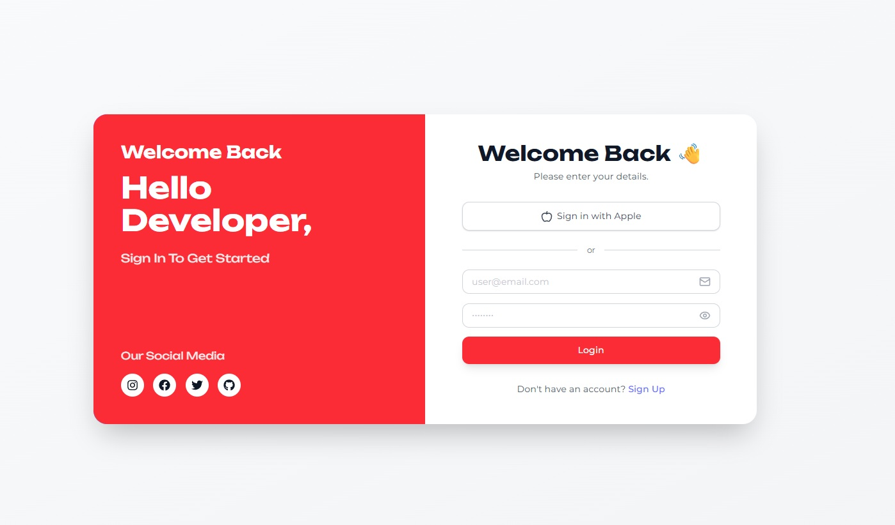
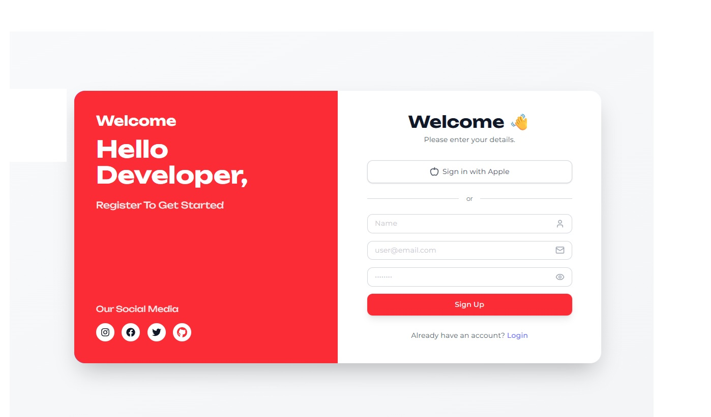
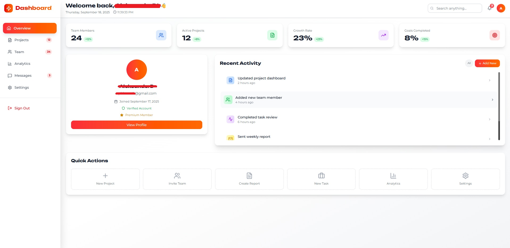
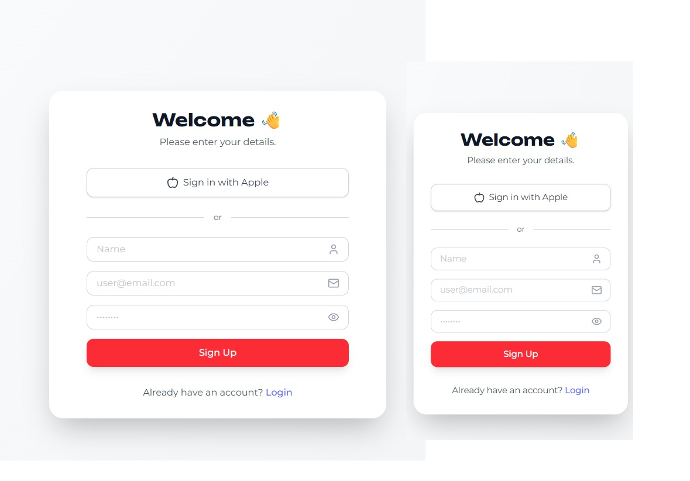

<div align="center">

# ⚡ Supabase Basic Login/Sign Up Page with Authentication ⚡

### _Beautiful • Responsive • Modern_


---

### 🎨 _A stunning, production-ready authentication experience_

_Built for developers who demand both beauty and functionality_

</div>

## ✨ **What Is This?**

> A basic login and sign up page using **Supabase**. It is made with **React**, **React Router**, **Vite**, **Tailwindcss** and **Supabase**. Its fully Responsive and Mobile Friendly (login/signup).

---

## 🚀 **Key Features**

> I will update this Project soon with more features.\*

<div align="center">

| Feature                      | Description                                        | Status   |
| ---------------------------- | -------------------------------------------------- | -------- |
| 🔐 **Secure Authentication** | Email/password with optional name field            | ✅ Ready |
| 📱 **Mobile-First Design**   | Fully responsive across all devices                | ✅ Ready |
| 🎨 **Modern UI/UX**          | Clean, intuitive interface with smooth transitions | ✅ Ready |
| ⚡ **Lightning Fast**        | Powered by Vite for instant development            | ✅ Ready |
| 🏠 **Dashboard Ready**       | User Home Page with Dashboard                      | ✅ Ready |

> You can find the code on [GitHub](https://github.com/Marmo77/Supa-base-login-withauth).

</div>

---

## 🖼️ **Visual Preview**

<div align="center">

### 🔓 **Login**


_Login Interface_

### 📝 **Sign Up**


_Sign Up Interface_

### 🏡 **Home Page**


_VibeCoded Home Page with Static informations in [] or UseStates([...])_

### 📱 **Mobile Responsivness**


_Working on every device_

</div>

---

## 🛠️ **Technology Stack**

<div align="center">

| Technology       | Description                                                 |
| ---------------- | ----------------------------------------------------------- |
| **React**        | JavaScript framework for building user interfaces           |
| **React Router** | Library for declarative routing in React applications       |
| **Tailwind CSS** | Utility-first CSS framework for rapid UI development        |
| **Supabase**     | Open-source PostgreSQL database with real-time capabilities |

</div>

### **Frontend Excellence**

- **React 18+** - Latest features and performance
- **React Router** - Smooth, client-side navigation
- **Tailwind CSS** - Utility-first styling perfection

### **Backend Power**

- **Supabase** - PostgreSQL with real-time subscriptions
- **Authentication** - Built-in user management
- **Database** - Instant APIs with zero configuration

### **Development Experience**

- **Vite** - Lightning-fast development server
- **Hot Reload** - Instant feedback loop
- **Modern JavaScript** - ES6+ features throughout

---

## 🚀 **Quick Start Guide**

### **Prerequisites**

- Node.js 16+ installed
- A Supabase account (free tier available)

### **Installation Steps**

#### 1️⃣ **Clone the Repository**

```bash
git clone https://github.com/Marmo77/Supa-base-login-withauth.git
cd Supa-base-login-withauth
```

#### 2️⃣ **Install Dependencies**

```bash
npm install
# or
yarn install
```

#### 3️⃣ **Environment Configuration**

Create `.env.local` in your project root:

```env
# 🔑 Supabase Configuration
VITE_SUPABASE_URL=your_supabase_project_url
VITE_SUPABASE_ANON_KEY=your_supabase_anon_key
```

> 💡 **Tip**: Find these values in your Supabase project settings under API

#### 4️⃣ **Launch Development Server**

```bash
npm run dev
# or
yarn dev
```

#### 5️⃣ **Open in Browser**

Navigate to `http://localhost:5173` and enhance it! ✨

---

## 🎯 **Perfect For**

<div align="center">

| Use Case                  | Why It's Great                               |
| ------------------------- | -------------------------------------------- |
| 🚀 **Rapid Prototyping**  | Get authentication up and running in minutes |
| 💼 **Client Projects**    | Professional-grade UI ready for production   |
| 📚 **Learning Supabase**  | Clean, well-commented code to study          |
| 🏗️ **Project Foundation** | Solid base for any React application         |

</div>

---

## 🔮 **What's Next?**

Ready to customize this for your needs? Here are some enhancement ideas:

- 🎨 Add your brand colors and styling
- 💻 Use shadcn/ui for better UI
- 🔐 Implement social login (Google, GitHub, etc.)
- 📧 Add email verification flow
- 🔄 Include password reset functionality
- 📊 Build comprehensive user profiles
- 🌙 Add dark mode support

---

<div align="center">

## 💫 **Made with Love**

_Created for developers, by developers_

**Happy coding!** 🎉

---

<sub>Built with ⚡ by [Marmo77](https://github.com/Marmo77) | Star ⭐ if this helped you!</sub>

</div>
